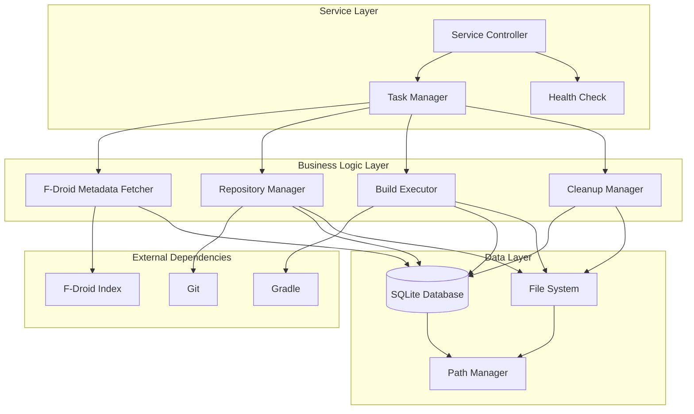
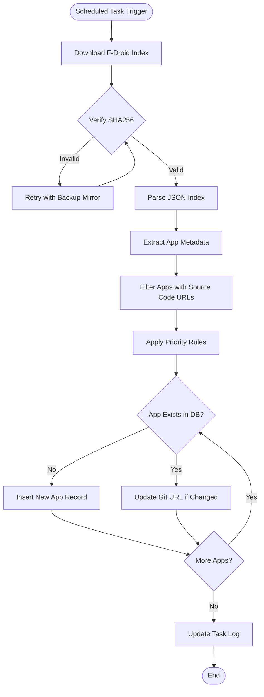
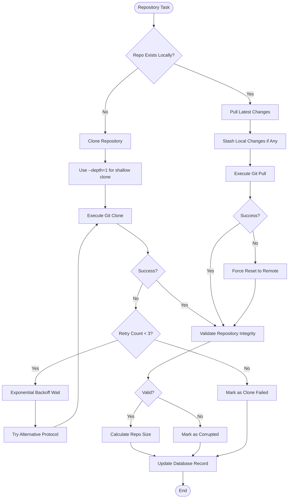
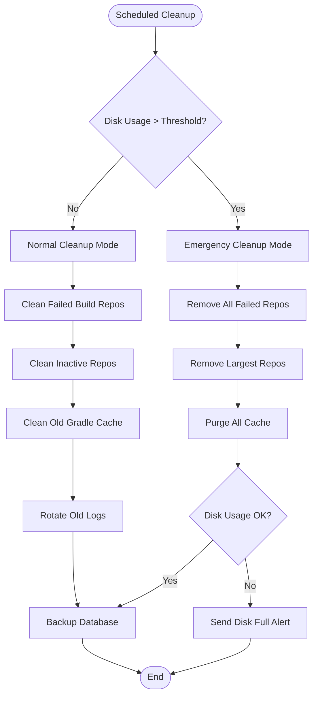
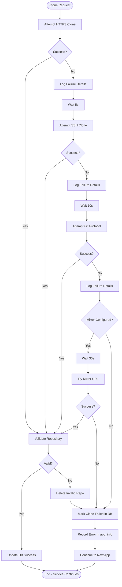
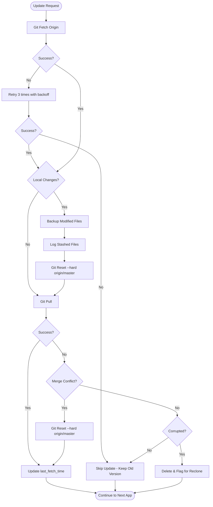
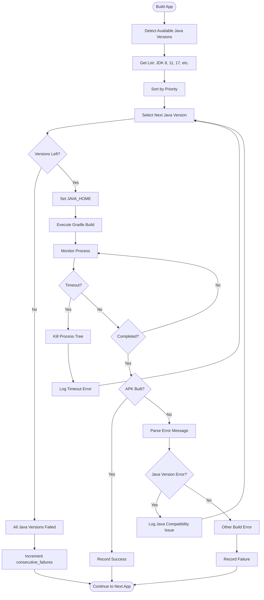
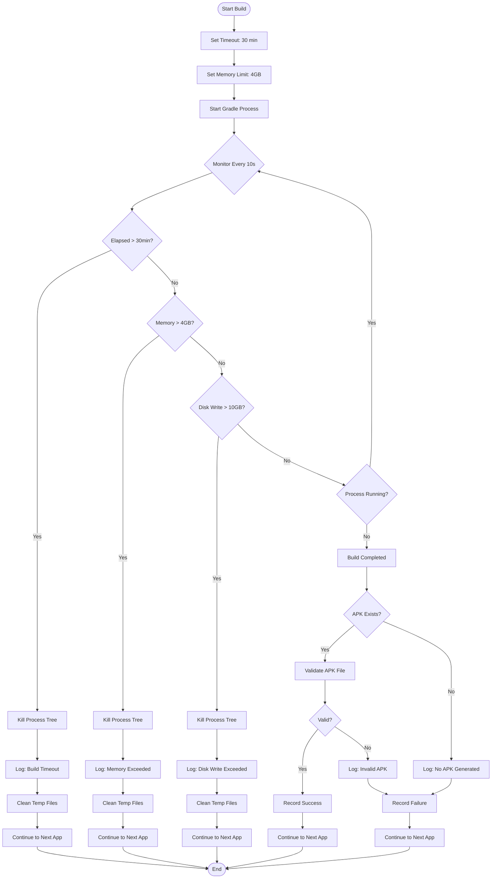
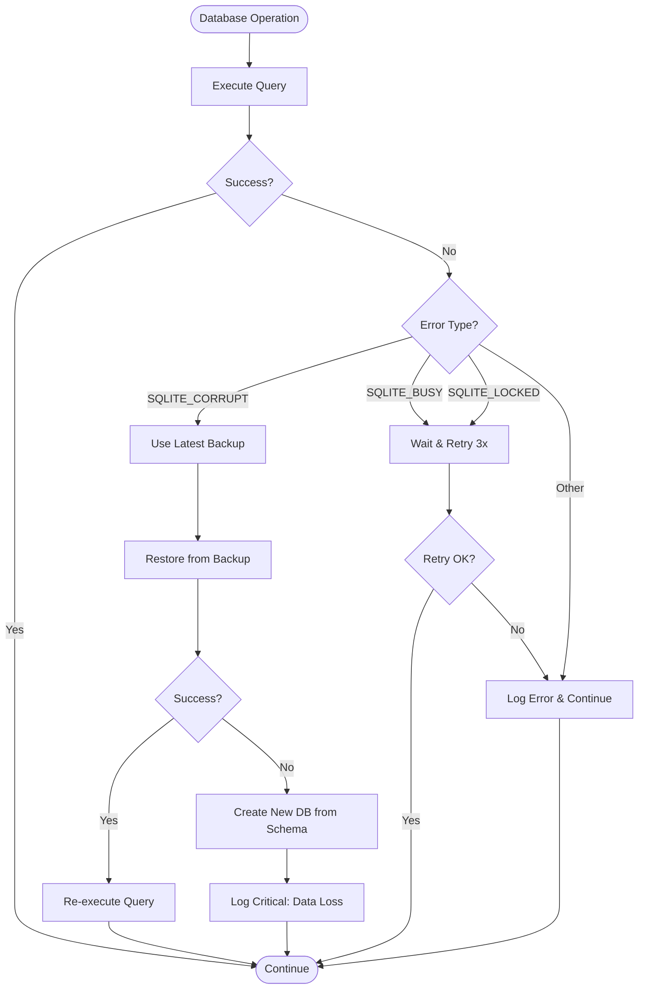

# F-Droid Auto-Builder Service Design

## Service Overview

A long-running Windows Server service that automatically fetches F-Droid app source code and performs local Gradle builds, with all resources explicitly stored outside the C: drive.

## System Architecture

### High-Level Component Structure



### Component Responsibilities

| Component | Purpose | Key Operations |
|-----------|---------|----------------|
| Service Controller | Service lifecycle management | Start, stop, restart, status monitoring |
| Task Manager | Schedule and coordinate tasks | Job scheduling, task queuing, execution coordination |
| Path Manager | Centralized path management | Ensure all paths are non-C drive, environment variable setup |
| F-Droid Metadata Fetcher | Retrieve app metadata | Download index, parse metadata, extract repository URLs |
| Repository Manager | Git repository operations | Clone, update, conflict resolution, validation |
| Build Executor | Gradle build execution | Environment check, build execution, timeout control, resource monitoring |
| Cleanup Manager | Resource cleanup | Remove failed repos, clean cache, log rotation |
| Health Check | Service health monitoring | Disk space check, task status, service availability |

## Directory Structure

The workspace root is configurable via environment variable, defaulting to `D:\fdroid_workspace`.

### Directory Layout

```
D:\fdroid_workspace\
├── sources\              # Git repositories
│   └── {app_id}\        # One directory per app
├── builds\              # Build outputs
│   └── {app_id}\
│       ├── apks\        # Generated APK files
│       └── logs\        # Per-build logs
├── cache\               # Cache directory
│   └── gradle\          # Gradle cache (GRADLE_USER_HOME)
│       ├── caches\      # Build cache
│       └── wrapper\dists\ # Gradle distributions
├── logs\                # Service logs
│   ├── service.log      # Main service log
│   ├── apps\            # Per-app build history logs
│   ├── service.stdout.log # NSSM stdout
│   └── service.stderr.log # NSSM stderr
├── database\            # Database files
│   └── service_state.db # SQLite database
└── temp\                # Temporary files
```

### Path Management Strategy

The Path Manager ensures all file operations occur outside the C: drive by:

- Accepting workspace root path via environment variable or configuration
- Validating that workspace root is not on C: drive during initialization
- Setting GRADLE_USER_HOME environment variable to point to workspace cache
- Providing centralized path resolution methods for all modules
- Creating directory structure on first run if not exists

## Data Model

### Database Schema

#### Table: app_info

Stores metadata and state for each F-Droid application.

| Column Name | Type | Constraints | Description |
|-------------|------|-------------|-------------|
| app_id | TEXT | PRIMARY KEY | Unique application identifier |
| git_url | TEXT | NOT NULL | Git repository URL |
| last_fetch_time | DATETIME | NULL | Last successful repository update |
| last_build_time | DATETIME | NULL | Last successful build completion |
| build_status | TEXT | NOT NULL | Current status: success/fail/pending/never_built |
| consecutive_failures | INTEGER | DEFAULT 0 | Count of consecutive build failures |
| repo_size | INTEGER | NULL | Repository size in bytes |
| last_attempt_time | DATETIME | NULL | Last build attempt timestamp |
| build_duration | INTEGER | NULL | Last build duration in seconds |
| created_at | DATETIME | DEFAULT CURRENT_TIMESTAMP | Record creation time |
| updated_at | DATETIME | DEFAULT CURRENT_TIMESTAMP | Last update time |

#### Table: build_history

Records historical build attempts for analysis and troubleshooting.

| Column Name | Type | Constraints | Description |
|-------------|------|-------------|-------------|
| id | INTEGER | PRIMARY KEY AUTOINCREMENT | Unique record ID |
| app_id | TEXT | NOT NULL, FOREIGN KEY | Reference to app_info |
| build_time | DATETIME | NOT NULL | Build execution timestamp |
| status | TEXT | NOT NULL | Build result: success/fail/timeout |
| duration | INTEGER | NULL | Build duration in seconds |
| log_path | TEXT | NULL | Relative path to build log |
| apk_size | INTEGER | NULL | Generated APK size in bytes |
| error_message | TEXT | NULL | Error description if failed |
| gradle_version | TEXT | NULL | Gradle version used |

#### Table: task_execution_log

Tracks scheduled task execution for monitoring and debugging.

| Column Name | Type | Constraints | Description |
|-------------|------|-------------|-------------|
| id | INTEGER | PRIMARY KEY AUTOINCREMENT | Unique record ID |
| task_name | TEXT | NOT NULL | Task identifier |
| start_time | DATETIME | NOT NULL | Task start timestamp |
| end_time | DATETIME | NULL | Task completion timestamp |
| status | TEXT | NOT NULL | Execution status: running/completed/failed |
| result_summary | TEXT | NULL | JSON-formatted execution summary |

### Database Operations

- Use parameterized queries to prevent SQL injection
- Implement connection pooling with proper timeout settings
- Use transactions for operations affecting multiple tables
- Create indexes on frequently queried columns: app_id, build_status, last_build_time
- Implement automatic database backup before cleanup operations

## Core Workflows

### 1. F-Droid Metadata Fetching Workflow



**Priority Rules for App Selection:**

- Prioritize apps with Git repositories over other VCS
- Skip apps without source code URLs
- Prefer apps with recent update timestamps in F-Droid index
- Apply size limits if configured

### 2. Repository Management Workflow



**Repository Validation Criteria:**

- .git directory exists and is accessible
- At least one commit exists in history
- Repository is not corrupted (git fsck passes)
- Repository size is within acceptable limits

**Error Handling Strategy:**

- Clone failures: Retry 3 times with exponential backoff (5s, 10s, 20s)
- Network timeouts: Switch to backup Git mirror if configured
- Disk full errors: Trigger emergency cleanup and abort operation
- Corrupted repositories: Delete and re-clone on next cycle

### 3. Build Execution Workflow

```mermaid
flowchart TD
    Start([Build Task]) --> SelectApps[Select Apps to Build]
    SelectApps --> AppLoop{More Apps?}
    AppLoop -->|No| Cleanup[Cleanup Temp Files]
    Cleanup --> End([End])
    
    AppLoop -->|Yes| PreCheck[Pre-Build Environment Check]
    PreCheck --> CheckGradlew{gradlew Exists?}
    CheckGradlew -->|No| SkipApp[Skip - Log Missing Wrapper]
    CheckGradlew -->|Yes| CheckBuildFile{build.gradle Exists?}
    CheckBuildFile -->|No| SkipApp
    CheckBuildFile -->|Yes| CheckJava{Java Available?}
    CheckJava -->|No| SkipApp
    
    CheckJava -->|Yes| SetEnv[Set Environment Variables]
    SetEnv --> StartMonitor[Start Resource Monitor]
    StartMonitor --> ExecBuild[Execute Gradle Build]
    
    ExecBuild --> Monitor{Build Running}
    Monitor -->|Timeout| KillProcess[Terminate Gradle Process]
    Monitor -->|Resource Exceeded| KillProcess
    Monitor -->|Completed| CollectOutput
    
    KillProcess --> MarkTimeout[Mark as Timeout Failure]
    MarkTimeout --> LogResult
    
    CollectOutput[Collect Build Output]
    CollectOutput --> CheckAPK{APK Generated?}
    CheckAPK -->|Yes| CopyAPK[Copy APK to builds/{app_id}/apks/]
    CheckAPK -->|No| MarkFail[Mark as Build Failed]
    
    CopyAPK --> RecordSuccess[Record Success in DB]
    MarkFail --> RecordFailure[Record Failure in DB]
    RecordSuccess --> LogResult
    RecordFailure --> LogResult
    
    LogResult[Save Build Log]
    LogResult --> SkipApp
    SkipApp --> AppLoop
```

**Build Environment Configuration:**

| Environment Variable | Value | Purpose |
|---------------------|-------|---------|
| GRADLE_USER_HOME | {workspace}/cache/gradle | Centralized Gradle cache |
| GRADLE_OPTS | -Xmx4g -XX:MaxMetaspaceSize=512m | JVM memory limits |
| ANDROID_SDK_ROOT | {configured_path} | Android SDK location |
| JAVA_HOME | {detected_java_path} | Java installation |

**Build Resource Limits:**

- Maximum build time: 30 minutes (configurable)
- Maximum memory usage: 4GB per build process
- Maximum concurrent builds: 3 (configurable)
- CPU affinity: Not restricted by default

**Build Selection Strategy:**

- Priority 1: Apps never built before (build_status = 'never_built')
- Priority 2: Apps with successful builds older than 7 days
- Priority 3: Apps with failed builds where consecutive_failures < 3
- Skip: Apps with consecutive_failures >= 3

### 4. Cleanup Management Workflow



**Cleanup Policies:**

| Policy Type | Condition | Action |
|-------------|-----------|--------|
| Failure-Based | consecutive_failures >= 3 AND last_attempt > 30 days ago | Delete repository and build outputs |
| Time-Based | No build activity for 90 days | Archive repository to compressed storage, then delete |
| Space-Based | Single repo size > 5GB | Delete if not built successfully in last 60 days |
| Cache Cleanup | Gradle cache files > 30 days old | Delete cache entries |
| Log Rotation | Log files > 100MB or > 30 days old | Compress and archive, keep last 10 files |
| Emergency | Total workspace > 95% disk capacity | Aggressive deletion of all failed/inactive repos |

**Database Backup Strategy:**

- Daily backup: Keep last 7 days
- Weekly backup: Keep last 4 weeks
- Backup location: {workspace}/database/backups/
- Backup format: SQLite file copy with timestamp

## Task Scheduling

### Scheduler Configuration

The service uses APScheduler with BackgroundScheduler and SQLite job store for persistence.

| Task Name | Trigger Type | Schedule | Max Instances | Purpose |
|-----------|--------------|----------|---------------|---------|
| fetch_metadata | interval | Every 24 hours | 1 | Download and update F-Droid app metadata |
| clone_new_repos | interval | Every 6 hours | 1 | Clone newly discovered repositories |
| update_repos | interval | Every 12 hours | 1 | Update existing repositories |
| build_apps | interval | Every 6 hours | 3 | Execute build tasks |
| cleanup_resources | cron | Sunday 2:00 AM | 1 | Perform cleanup operations |
| health_check | interval | Every 15 minutes | 1 | Monitor service health |
| backup_database | cron | Daily 3:00 AM | 1 | Backup database |

**Scheduler Persistence:**

- Job store: SQLite database in {workspace}/database/scheduler.db
- Misfire grace time: 3600 seconds (1 hour)
- Coalesce missed runs: True (combine multiple missed executions into one)
- Max instances per job: As specified in table above

**Task Execution Flow Control:**

- Tasks acquire exclusive locks before execution to prevent overlaps
- Failed tasks are logged but do not block subsequent scheduled runs
- Long-running tasks report progress at regular intervals
- Tasks can be paused/resumed via service control interface

## Service Management

### Windows Service Integration via NSSM

**Service Configuration:**

| Parameter | Value | Purpose |
|-----------|-------|---------|
| Service Name | FDroidAutoBuilder | Windows service identifier |
| Display Name | F-Droid Auto Builder Service | Human-readable name |
| Application Path | {python_installation}\python.exe | Python interpreter |
| Application Arguments | main.py | Entry point script |
| Startup Directory | {workspace_root} | Working directory |
| Startup Type | Automatic (Delayed Start) | Start after system boots |
| Log on as | Local System Account | Service account |

**Auto-Restart Configuration:**

- Exit action: Restart service
- Restart delay: 5000ms (5 seconds)
- Throttle restart: 10000ms (10 seconds) between consecutive restarts
- Reset fail count: After 86400 seconds (24 hours)

**Stdout/Stderr Redirection:**

- Stdout: {workspace}/logs/service.stdout.log
- Stderr: {workspace}/logs/service.stderr.log
- Rotation: Enabled, 10MB max per file

### Service Control Interface

The service exposes control operations through signal handlers and optional HTTP API.

**Supported Operations:**

| Operation | Trigger Mechanism | Behavior |
|-----------|------------------|----------|
| Start | NSSM service start | Initialize all components, start scheduler |
| Stop | NSSM service stop / SIGTERM | Graceful shutdown: finish current tasks, save state |
| Restart | NSSM service restart | Stop + Start sequence |
| Pause Scheduling | Signal / API call | Stop accepting new tasks, continue running tasks |
| Resume Scheduling | Signal / API call | Resume task scheduling |
| Force Stop | SIGKILL | Immediate termination without cleanup |

**Graceful Shutdown Process:**

1. Stop accepting new scheduled tasks
2. Set shutdown flag to prevent new task starts
3. Wait for running tasks to complete (max 5 minutes)
4. Force-terminate remaining tasks
5. Flush logs and close database connections
6. Exit with code 0

## Monitoring and Health Checks

### Health Check Endpoints

Optional HTTP server for health monitoring and status queries.

**Health Check Response Structure:**

| Field | Type | Description |
|-------|------|-------------|
| status | string | Overall health: healthy/degraded/unhealthy |
| timestamp | datetime | Current server time |
| workspace_root | string | Workspace root path |
| disk_free_gb | number | Available disk space in GB |
| disk_usage_percent | number | Disk usage percentage |
| active_tasks | number | Currently running tasks |
| total_apps | number | Total apps in database |
| pending_builds | number | Apps waiting to be built |
| failed_apps | number | Apps with recent failures |
| last_metadata_fetch | datetime | Last successful metadata update |
| scheduler_running | boolean | Scheduler operational status |

**Health Status Determination:**

- Healthy: All systems operational, disk usage < 85%
- Degraded: Disk usage 85-95%, or recent task failures
- Unhealthy: Disk usage > 95%, or scheduler not running, or critical errors

### Logging Strategy

**Log Levels and Usage:**

| Level | Usage Scenario |
|-------|----------------|
| DEBUG | Detailed diagnostic information, disabled in production |
| INFO | General operational events (task start/end, normal operations) |
| WARNING | Recoverable errors, retry attempts, approaching thresholds |
| ERROR | Failed operations, exceptions that don't crash the service |
| CRITICAL | Service-level failures, imminent crashes |

**Log Output Format:**

Structured JSON format for machine parsing:

| Field | Description |
|-------|-------------|
| timestamp | ISO 8601 formatted timestamp |
| level | Log level string |
| logger | Logger name (module/component identifier) |
| message | Human-readable log message |
| app_id | Application identifier (if applicable) |
| task_name | Task name (if applicable) |
| duration | Operation duration in seconds (if applicable) |
| exception | Exception traceback (for ERROR/CRITICAL) |

**Log File Organization:**

| Log File | Content | Rotation Policy |
|----------|---------|-----------------|
| service.log | Main service log | 50MB max, keep 10 files |
| apps/{app_id}.log | Per-app operation history | 10MB max, keep 5 files |
| builds/{app_id}/build_{timestamp}.log | Individual build logs | No rotation, cleaned by cleanup manager |
| service.stdout.log | NSSM stdout capture | 10MB max, NSSM handles rotation |
| service.stderr.log | NSSM stderr capture | 10MB max, NSSM handles rotation |

### Alert Mechanisms

**Alert Triggers:**

| Condition | Severity | Action |
|-----------|----------|--------|
| Disk usage > 95% | Critical | Log critical message, trigger emergency cleanup |
| Disk usage > 85% | Warning | Log warning, notify in health check |
| Consecutive task failures > 5 | Warning | Log warning with task details |
| Database write failure | Critical | Log critical, attempt to switch to backup DB |
| Scheduler stopped | Critical | Log critical, attempt auto-restart |
| Java/Git not found | Error | Log error, skip affected tasks |

## Security Considerations

### Input Validation

**Git URL Validation:**

- Whitelist protocols: https, http, git
- Validate URL format using regex pattern
- Reject URLs with suspicious characters or patterns
- Limit URL length to prevent buffer overflow attacks

**App ID Validation:**

- Allow only alphanumeric characters, dots, underscores, hyphens
- Reject path traversal attempts (../, ..\, etc.)
- Maximum length: 255 characters

### Process Isolation

**Build Process Sandboxing:**

- Execute Gradle builds in separate process with limited privileges
- Set working directory to app-specific path
- Prevent access to parent directories through environment variables
- Kill process tree on timeout to prevent orphaned processes

### Dependency Management

**Dependency Verification:**

- Verify F-Droid index file integrity using SHA256 checksum
- Use specific Gradle versions rather than "latest"
- Consider caching validated dependencies to reduce external network calls

### File System Security

**Path Traversal Prevention:**

- Validate all file paths are within workspace root
- Use absolute paths for all file operations
- Reject symbolic links pointing outside workspace

**Permission Management:**

- Service account has read/write access only to workspace directory
- No admin/root privileges required for normal operation
- Log files readable by administrators for troubleshooting

## Deployment Prerequisites

### Software Dependencies

| Component | Minimum Version | Installation Notes |
|-----------|----------------|-------------------|
| Python | 3.8 | Install to non-C drive, add to PATH |
| Git for Windows | 2.30 | Install to non-C drive, select "Git from command line" |
| Java JDK | 8, 11, or 17 | Install to non-C drive, set JAVA_HOME |
| NSSM | 2.24 | Download and extract to accessible location |

**Python Package Dependencies:**

- APScheduler >= 3.9.0 (task scheduling)
- GitPython >= 3.1.0 (Git operations)
- requests >= 2.28.0 (HTTP requests for F-Droid index)
- psutil >= 5.9.0 (resource monitoring)
- Flask >= 2.0.0 (optional, for health check HTTP server)

### Disk Space Requirements

| Category | Recommended Minimum |
|----------|-------------------|
| Initial workspace | 10 GB |
| Per repository average | 50-200 MB |
| Gradle cache | 10-30 GB |
| Build outputs | 5-20 GB |
| Logs and database | 1-5 GB |
| Total recommended | 200 GB+ |

### Environment Variables

| Variable | Purpose | Example Value |
|----------|---------|---------------|
| FDROID_WORKSPACE | Workspace root path | D:\fdroid_workspace |
| GRADLE_USER_HOME | Gradle cache location | D:\fdroid_workspace\cache\gradle |
| JAVA_HOME | Java installation path | D:\Java\jdk-11 |
| GIT_EXEC_PATH | Git executable location | D:\Git\cmd |

### Initial Setup Procedure

**Pre-Deployment Checklist:**

1. Verify all software dependencies installed to non-C drive locations
2. Confirm workspace root drive has sufficient free space
3. Validate Python packages installed successfully
4. Test Git and Java executables accessible from command line
5. Configure firewall rules if HTTP health check server enabled
6. Create service account with appropriate permissions

**Deployment Steps:**

1. Create workspace directory structure using Path Manager initialization
2. Configure environment variables system-wide or in NSSM settings
3. Initialize SQLite database with schema
4. Register service with NSSM using provided configuration
5. Start service and verify health check status
6. Monitor first metadata fetch and build cycle for issues

## Configuration Management

### Configuration File Structure

Configuration uses INI format with the following sections:

**[workspace]**

- root_path: Absolute path to workspace root
- validate_non_c_drive: Boolean to enforce non-C drive requirement

**[scheduler]**

- fetch_metadata_interval_hours: Hours between metadata fetches
- build_interval_hours: Hours between build cycles
- cleanup_day_of_week: Day for cleanup (0-6, Monday=0)
- cleanup_hour: Hour for cleanup (0-23)

**[build]**

- max_concurrent_builds: Maximum parallel builds
- build_timeout_minutes: Timeout for single build
- max_consecutive_failures: Threshold for abandoning app
- gradle_memory_gb: Max memory for Gradle JVM

**[cleanup]**

- max_repo_size_gb: Maximum size for single repository
- inactive_days: Days before considering app inactive
- gradle_cache_retention_days: Days to keep Gradle cache
- max_workspace_size_gb: Total workspace size limit

**[logging]**

- log_level: Minimum log level (DEBUG/INFO/WARNING/ERROR/CRITICAL)
- max_log_file_mb: Maximum size before rotation
- log_backup_count: Number of rotated files to keep
- json_format: Use JSON structured logging

**[health_check]**

- enable_http_server: Enable optional HTTP health check endpoint
- http_port: Port for health check server
- http_host: Host binding for health check server

### Runtime Configuration Changes

- Configuration file monitored for changes using file system watcher
- Non-critical settings reloaded without service restart
- Critical settings (workspace path, database location) require restart
- Configuration validation performed before applying changes
- Invalid configuration changes logged and rejected

## Extensibility and Future Enhancements

### Modular Design Principles

- Each major component (Fetcher, Repository Manager, Builder, Cleanup) operates independently
- Components communicate through well-defined interfaces and database state
- New build systems can be added by implementing Build Executor interface
- New cleanup strategies can be added without modifying core cleanup logic

## Robustness and Error Handling

### Error Isolation Principles

**Critical Design Rule:** Individual app failures must NEVER interrupt the main service workflow or affect other apps.

**Isolation Mechanisms:**

- Each app operation wrapped in independent try-catch blocks
- Failures recorded to database and logs, then execution continues to next app
- Task-level failures do not terminate the scheduler
- Resource exhaustion in one build does not block other builds
- Database transaction failures trigger rollback but allow service continuation

### Repository Clone Robustness

**Multi-Layer Retry Strategy:**

| Retry Layer | Condition | Action | Max Attempts | Backoff |
|-------------|-----------|--------|--------------|----------|
| Protocol Retry | Clone fails | Switch HTTPS ↔ SSH ↔ Git protocol | 3 | 5s, 10s, 20s |
| Mirror Retry | All protocols fail | Try backup Git mirror (if configured) | 2 | 30s, 60s |
| Shallow Retry | Full clone timeout | Retry with --depth=1 | 1 | None |
| Deferred Retry | All attempts fail | Mark as failed, retry in next cycle | ∞ | 24 hours |

**Clone Operation Flow with Error Handling:**



**Timeout Configuration for Clone Operations:**

| Operation Type | Timeout | Behavior on Timeout |
|----------------|---------|---------------------|
| Single clone attempt | 10 minutes | Kill git process, try next protocol |
| Total clone operation | 45 minutes | Abandon app, mark failed, continue to next |
| Repository validation | 2 minutes | Mark as corrupted, delete, continue |

**Network Error Handling:**

- Connection timeout: Retry with exponential backoff
- DNS resolution failure: Log and defer to next cycle
- Proxy errors: Attempt direct connection if proxy configured
- Certificate errors: Log warning, attempt with relaxed SSL verification only if explicitly configured
- Rate limiting (HTTP 429): Wait specified retry-after period, max 15 minutes

### Repository Update Robustness

**Conflict Resolution Strategy:**



**Update Error Recovery:**

- Detached HEAD state: Force checkout to default branch
- Corrupted index: Delete .git/index and rebuild from HEAD
- Missing objects: Re-fetch with --force
- Packed refs corruption: Delete .git/packed-refs and re-fetch
- Unrecoverable corruption: Delete entire repo, flag for fresh clone

### Build Execution Robustness

**Multi-Java Version Build Strategy:**



**Java Version Detection and Priority:**

| Java Version | Detection Path | Priority | Use Case |
|--------------|----------------|----------|----------|
| JDK 17 | JAVA17_HOME or registry | 1 | Modern apps, AGP 7.0+ |
| JDK 11 | JAVA11_HOME or registry | 2 | Apps using AGP 4.0-7.0 |
| JDK 8 | JAVA8_HOME or registry | 3 | Legacy apps, AGP < 4.0 |
| System Default | JAVA_HOME | 4 | Fallback |

**Build Failure Classification:**

| Error Pattern | Classification | Retry Strategy | Java Switch |
|---------------|----------------|----------------|-------------|
| "Unsupported class file major version" | Java version incompatibility | Yes | Try older Java |
| "Requires Java 11 or higher" | Java version requirement | Yes | Try newer Java |
| "OutOfMemoryError" | Resource exhaustion | No (log only) | No |
| "Execution failed for task" | Gradle task failure | No | Try different Java |
| "Could not resolve dependencies" | Network/dependency issue | Retry same config | No |
| "BUILD SUCCESSFUL" but no APK | Configuration issue | No | Try different Java |
| Timeout (no output) | Infinite loop / hang | No | No |

**Build Timeout and Resource Control:**



### Task-Level Error Handling

**Scheduled Task Resilience:**

| Task Failure Scenario | Handling Strategy | Impact on Other Tasks |
|----------------------|-------------------|----------------------|
| Metadata fetch fails | Log error, use cached metadata, retry next cycle | None - other tasks continue |
| Database write fails | Retry 3 times, log critical error, continue | None - data may be stale |
| Single app clone fails | Skip app, continue to next app | None |
| Build task crashes | Log stack trace, mark all pending builds as skipped | None - next cycle will retry |
| Cleanup task fails | Log error, skip cleanup, retry next scheduled time | None - disk space may fill |
| Scheduler stops | Attempt auto-restart, log critical alert | All tasks paused until restart |

**Error Propagation Prevention:**

Each task follows this wrapper pattern:

1. Begin transaction (if database operation)
2. Try: Execute task logic with per-item error handling
3. Catch: Log exception with full context
4. Finally: Commit successful operations, log task completion
5. Return: Task status (success/partial/failed) without throwing exceptions

**Batch Operation Error Handling:**

When processing multiple apps in a single task:

- Process apps in isolated iterations
- Each app wrapped in individual try-catch block
- Failed apps logged and skipped
- Success count and failure count tracked
- Task marked successful if at least one app processed successfully
- Task marked failed only if zero apps processed due to system-level error

### Database Robustness

**Connection Management:**

- Connection pool with automatic reconnection
- Retry failed queries up to 3 times with 1s delay
- Detect locked database (SQLITE_BUSY) and wait up to 30s
- Use WAL mode for better concurrent access
- Periodic PRAGMA integrity_check

**Transaction Safety:**

- Use transactions for all write operations
- Automatic rollback on exceptions
- Savepoints for nested operations
- Explicit commit only after validation

**Corruption Recovery:**



### Resource Exhaustion Handling

**Disk Space Monitoring:**

| Threshold | Action | Priority |
|-----------|--------|----------|
| < 20 GB free | Warning log | Low |
| < 10 GB free | Trigger emergency cleanup | Medium |
| < 5 GB free | Stop accepting new builds, cleanup only | High |
| < 2 GB free | Pause all operations, critical alert | Critical |

**Memory Pressure Response:**

- Monitor system available memory before starting builds
- If available memory < 2GB, reduce max_concurrent_builds
- If available memory < 1GB, pause new builds until memory recovers
- Force garbage collection between builds if memory usage high

**Network Timeout Configuration:**

| Operation | Connection Timeout | Read Timeout | Total Timeout |
|-----------|-------------------|--------------|---------------|
| F-Droid index download | 30s | 60s | 5 minutes |
| Git clone | 30s | 120s | 10 minutes per attempt |
| Git fetch | 30s | 60s | 5 minutes |
| Dependency download (Gradle) | 30s | 300s | Controlled by Gradle |

### Logging for Troubleshooting

**Enhanced Error Logging:**

Every error log entry must include:

| Field | Content |
|-------|----------|
| timestamp | ISO 8601 timestamp |
| severity | ERROR or CRITICAL |
| app_id | Application identifier (if applicable) |
| operation | Specific operation that failed |
| error_type | Classified error type |
| error_message | Exception message or error description |
| retry_count | Current retry attempt number |
| stack_trace | Full stack trace for exceptions |
| context | Relevant context (Git URL, Java version, etc.) |
| recovery_action | What action was taken after error |

**Error Pattern Detection:**

- Track recurring errors by error_type and app_id
- If same error occurs 5+ times for same app, flag app as problematic
- Generate daily error summary report in logs
- Identify systemic issues (e.g., network problems affecting many apps)

## Extensibility and Modular Design

### Component Independence

- Each major component (Fetcher, Repository Manager, Builder, Cleanup) operates independently
- Components communicate through well-defined database contracts
- Component failure is isolated and does not cascade
- New components can be added without modifying existing ones

### Interface Abstractions

**Build Executor Interface:**

- Abstract interface for different build systems
- Default implementation: Gradle Builder
- Future implementations: Maven Builder, Custom Script Builder
- Each builder handles its own error scenarios

**Repository Provider Interface:**

- Abstract interface for different VCS systems
- Default implementation: Git Provider
- Future implementations: SVN Provider, Mercurial Provider
- Each provider implements standard operations: clone, update, validate
| Start | NSSM service start | Initialize all components, start scheduler |
| Stop | NSSM service stop / SIGTERM | Graceful shutdown: finish current tasks, save state |
| Restart | NSSM service restart | Stop + Start sequence |
| Pause Scheduling | Signal / API call | Stop accepting new tasks, continue running tasks |
| Resume Scheduling | Signal / API call | Resume task scheduling |
| Force Stop | SIGKILL | Immediate termination without cleanup |

**Graceful Shutdown Process:**

1. Stop accepting new scheduled tasks
2. Set shutdown flag to prevent new task starts
3. Wait for running tasks to complete (max 5 minutes)
4. Force-terminate remaining tasks
5. Flush logs and close database connections
6. Exit with code 0

## Monitoring and Health Checks

### Health Check Endpoints

Optional HTTP server for health monitoring and status queries.

**Health Check Response Structure:**

| Field | Type | Description |
|-------|------|-------------|
| status | string | Overall health: healthy/degraded/unhealthy |
| timestamp | datetime | Current server time |
| workspace_root | string | Workspace root path |
| disk_free_gb | number | Available disk space in GB |
| disk_usage_percent | number | Disk usage percentage |
| active_tasks | number | Currently running tasks |
| total_apps | number | Total apps in database |
| pending_builds | number | Apps waiting to be built |
| failed_apps | number | Apps with recent failures |
| last_metadata_fetch | datetime | Last successful metadata update |
| scheduler_running | boolean | Scheduler operational status |

**Health Status Determination:**

- Healthy: All systems operational, disk usage < 85%
- Degraded: Disk usage 85-95%, or recent task failures
- Unhealthy: Disk usage > 95%, or scheduler not running, or critical errors

### Logging Strategy

**Log Levels and Usage:**

| Level | Usage Scenario |
|-------|----------------|
| DEBUG | Detailed diagnostic information, disabled in production |
| INFO | General operational events (task start/end, normal operations) |
| WARNING | Recoverable errors, retry attempts, approaching thresholds |
| ERROR | Failed operations, exceptions that don't crash the service |
| CRITICAL | Service-level failures, imminent crashes |

**Log Output Format:**

Structured JSON format for machine parsing:

| Field | Description |
|-------|-------------|
| timestamp | ISO 8601 formatted timestamp |
| level | Log level string |
| logger | Logger name (module/component identifier) |
| message | Human-readable log message |
| app_id | Application identifier (if applicable) |
| task_name | Task name (if applicable) |
| duration | Operation duration in seconds (if applicable) |
| exception | Exception traceback (for ERROR/CRITICAL) |

**Log File Organization:**

| Log File | Content | Rotation Policy |
|----------|---------|-----------------|
| service.log | Main service log | 50MB max, keep 10 files |
| apps/{app_id}.log | Per-app operation history | 10MB max, keep 5 files |
| builds/{app_id}/build_{timestamp}.log | Individual build logs | No rotation, cleaned by cleanup manager |
| service.stdout.log | NSSM stdout capture | 10MB max, NSSM handles rotation |
| service.stderr.log | NSSM stderr capture | 10MB max, NSSM handles rotation |

### Alert Mechanisms

**Alert Triggers:**

| Condition | Severity | Action |
|-----------|----------|--------|
| Disk usage > 95% | Critical | Log critical message, trigger emergency cleanup |
| Disk usage > 85% | Warning | Log warning, notify in health check |
| Consecutive task failures > 5 | Warning | Log warning with task details |
| Database write failure | Critical | Log critical, attempt to switch to backup DB |
| Scheduler stopped | Critical | Log critical, attempt auto-restart |
| Java/Git not found | Error | Log error, skip affected tasks |

## Security Considerations

### Input Validation

**Git URL Validation:**

- Whitelist protocols: https, http, git
- Validate URL format using regex pattern
- Reject URLs with suspicious characters or patterns
- Limit URL length to prevent buffer overflow attacks

**App ID Validation:**

- Allow only alphanumeric characters, dots, underscores, hyphens
- Reject path traversal attempts (../, ..\, etc.)
- Maximum length: 255 characters

### Process Isolation

**Build Process Sandboxing:**

- Execute Gradle builds in separate process with limited privileges
- Set working directory to app-specific path
- Prevent access to parent directories through environment variables
- Kill process tree on timeout to prevent orphaned processes

### Dependency Management

**Dependency Verification:**

- Verify F-Droid index file integrity using SHA256 checksum
- Use specific Gradle versions rather than "latest"
- Consider caching validated dependencies to reduce external network calls

### File System Security

**Path Traversal Prevention:**

- Validate all file paths are within workspace root
- Use absolute paths for all file operations
- Reject symbolic links pointing outside workspace

**Permission Management:**

- Service account has read/write access only to workspace directory
- No admin/root privileges required for normal operation
- Log files readable by administrators for troubleshooting

## Deployment Prerequisites

### Software Dependencies

| Component | Minimum Version | Installation Notes |
|-----------|----------------|-------------------|
| Python | 3.8 | Install to non-C drive, add to PATH |
| Git for Windows | 2.30 | Install to non-C drive, select "Git from command line" |
| Java JDK | 8, 11, or 17 | Install to non-C drive, set JAVA_HOME |
| NSSM | 2.24 | Download and extract to accessible location |

**Python Package Dependencies:**

- APScheduler >= 3.9.0 (task scheduling)
- GitPython >= 3.1.0 (Git operations)
- requests >= 2.28.0 (HTTP requests for F-Droid index)
- psutil >= 5.9.0 (resource monitoring)
- Flask >= 2.0.0 (optional, for health check HTTP server)

### Disk Space Requirements

| Category | Recommended Minimum |
|----------|-------------------|
| Initial workspace | 10 GB |
| Per repository average | 50-200 MB |
| Gradle cache | 10-30 GB |
| Build outputs | 5-20 GB |
| Logs and database | 1-5 GB |
| Total recommended | 200 GB+ |

### Environment Variables

| Variable | Purpose | Example Value |
|----------|---------|---------------|
| FDROID_WORKSPACE | Workspace root path | D:\fdroid_workspace |
| GRADLE_USER_HOME | Gradle cache location | D:\fdroid_workspace\cache\gradle |
| JAVA_HOME | Java installation path | D:\Java\jdk-11 |
| GIT_EXEC_PATH | Git executable location | D:\Git\cmd |

### Initial Setup Procedure

**Pre-Deployment Checklist:**

1. Verify all software dependencies installed to non-C drive locations
2. Confirm workspace root drive has sufficient free space
3. Validate Python packages installed successfully
4. Test Git and Java executables accessible from command line
5. Configure firewall rules if HTTP health check server enabled
6. Create service account with appropriate permissions

**Deployment Steps:**

1. Create workspace directory structure using Path Manager initialization
2. Configure environment variables system-wide or in NSSM settings
3. Initialize SQLite database with schema
4. Register service with NSSM using provided configuration
5. Start service and verify health check status
6. Monitor first metadata fetch and build cycle for issues

## Configuration Management

### Configuration File Structure

Configuration uses INI format with the following sections:

**[workspace]**

- root_path: Absolute path to workspace root
- validate_non_c_drive: Boolean to enforce non-C drive requirement

**[scheduler]**

- fetch_metadata_interval_hours: Hours between metadata fetches
- build_interval_hours: Hours between build cycles
- cleanup_day_of_week: Day for cleanup (0-6, Monday=0)
- cleanup_hour: Hour for cleanup (0-23)

**[build]**

- max_concurrent_builds: Maximum parallel builds
- build_timeout_minutes: Timeout for single build
- max_consecutive_failures: Threshold for abandoning app
- gradle_memory_gb: Max memory for Gradle JVM

**[cleanup]**

- max_repo_size_gb: Maximum size for single repository
- inactive_days: Days before considering app inactive
- gradle_cache_retention_days: Days to keep Gradle cache
- max_workspace_size_gb: Total workspace size limit

**[logging]**

- log_level: Minimum log level (DEBUG/INFO/WARNING/ERROR/CRITICAL)
- max_log_file_mb: Maximum size before rotation
- log_backup_count: Number of rotated files to keep
- json_format: Use JSON structured logging

**[health_check]**

- enable_http_server: Enable optional HTTP health check endpoint
- http_port: Port for health check server
- http_host: Host binding for health check server

### Runtime Configuration Changes

- Configuration file monitored for changes using file system watcher
- Non-critical settings reloaded without service restart
- Critical settings (workspace path, database location) require restart
- Configuration validation performed before applying changes
- Invalid configuration changes logged and rejected

## Extensibility and Future Enhancements

### Modular Design Principles

- Each major component (Fetcher, Repository Manager, Builder, Cleanup) operates independently
- Components communicate through well-defined interfaces and database state
- New build systems can be added by implementing Build Executor interface
- New cleanup strategies can be added without modifying core cleanup logic

### Potential Enhancement Areas

**Build System Support:**

- Maven build support for non-Gradle apps
- Ant build support for legacy apps
- Custom build script execution

**Repository Management:**

- Support for Subversion repositories
- Support for Mercurial repositories
- Shallow clone optimization for large repositories

**Build Optimization:**

- Distributed build cache across multiple machines
- Build dependency caching and reuse
- Incremental build support

**Monitoring and Analytics:**

- Build success rate metrics over time
- Popular apps identification based on build frequency
- Resource usage analytics and optimization recommendations
- Integration with monitoring systems (Prometheus, Grafana)

**Advanced Cleanup:**

- Machine learning-based prediction of build success probability
- Intelligent cache eviction based on usage patterns
- Automated repository archiving to cloud storage

**Security Enhancements:**

- Build output signature verification
- Sandboxed build environment using containers
- Automated vulnerability scanning of built APKs
